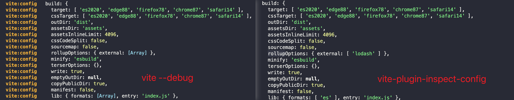

# vite-plugin-inspect-config [](https://npmjs.com/package/vite-plugin-inspect-config)

[](https://github.com/tjx666/vite-plugin-inspect-config/actions/workflows/unit-test.yml)

Inspect vite resolved config with infinite object level

> **NOTE**
> You can utilize the `DEBUG_DEPTH` [environment variable](https://github.com/debug-js/debug#environment-variables) within the [debug](https://github.com/debug-js/debug) package to output configuration at an infinite depth level.



## Installation

```bash
npm i -D vite-plugin-inspect-config
```

## Usage

```ts
// vite.config.ts
import vitePluginInspectConfig from 'vite-plugin-inspect-config';

export default defineConfig({
  plugins: [
    vitePluginInspectConfig({
      // You can use shortcut `.` to output resolved config when `vite dev`
      enable: true,
    }),
  ],
});
```

## TODOs

- [ ] output rollup, esbuild version
- [ ] output the pre built packages name

## License

[MIT](./LICENSE) License © 2023-PRESENT [YuTengjing](https://github.com/tjx666)
